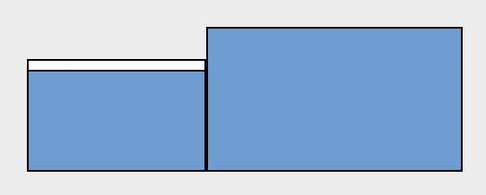
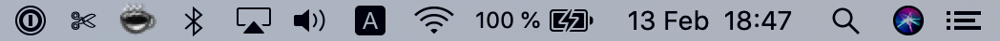

# macOSsetup
I'm currently using a MacBook Pro 16" (2019) and an external 27" monitor (LG 27UD88-W). This is how the screen arrangement looks like:

## Apps

The first ones I download are at the top (Flycut ❤️, caffeine, 1password BetterSnapTool and Dropbox).

1. Flycut - https://apps.apple.com/app/id442160987
2. Caffeine - http://lightheadsw.com/caffeine/
3. 1password - https://apps.apple.com/app/id1333542190
4. BetterSnapTool - https://apps.apple.com/app/id417375580
5. Dropbox - https://www.dropbox.com/install
6. RescueTime - https://www.rescuetime.com/download-rescuetime
7. Calendar | Fantastical - https://flexibits.com/fantastical
8. Tripmode - https://www.tripmode.ch
9. Firefox - https://www.mozilla.org/en-US/firefox/new/
10. VLC - https://www.videolan.org/vlc/download-macosx.html
11. Spotify - https://www.spotify.com/download/mac
12. Pocket - https://apps.apple.com/app/id568494494
13. Slack -  https://apps.apple.com/app/id618783545
14. Zeplin - https://zeplin.io
15. Sketch - https://www.sketch.com
16. Sip - https://sipapp.io
17. Monodraw - https://monodraw.helftone.com
18. iTerm2 - https://iterm2.com
19. Trailer.app - https://ptsochantaris.github.io/trailer/
20. Xcode - https://apps.apple.com/app/id497799835
21. Sourcetree - https://www.sourcetreeapp.com
22. Visual Studio Code - https://code.visualstudio.com
23. Kaleidoscope - https://www.kaleidoscopeapp.com
24. Dash - https://kapeli.com/dash
25. Paw - https://paw.cloud
26. Charles Proxy - https://www.charlesproxy.com
27. SnippetsLab - https://apps.apple.com/app/id1006087419
29. DaisyDisk - https://daisydiskapp.com
30. The Unarchiver - https://macpaw.com/the-unarchiver
31. Tunnelblick - https://tunnelblick.net
32. AirBuddy - https://gumroad.com/l/airbuddy
33. Lightpaper - https://getlightpaper.com | Typora - https://www.typora.io
34. Deckset - https://www.deckset.com
35. Pages, Number & Keynote
36. Tweetbot - https://www.tapbots.com/tweetbot/mac/ | Twitter - https://apps.apple.com/app/id1482454543

## Configurations

### Statusbar

This is how my status bar looks like:

(Clock must be 24h. Show date, no day of week. Show BlueTooth icon. Show Audio icon. Show battery percentage)

### Trackpad

WIP

### Keyboard

WIP

### Terminal (iTerm2 + zsh)

WIP

### Safari extensions

- WOT - https://www.mywot.com - Pretty useful when you're not sure about entrusting a website
- 1Password - My password manager of choice
- AdBlock - You just cannot surf without one

### Bonus

#### Blocking hostnames

Blocking hostnames (aka rerouting on `/etc/hosts`) is a must nowadays. Here's the most famoust list I know: https://github.com/StevenBlack/hosts

Note: If you work on advertising (sorry about that) this may affect, like not properly showing ads on the iOS simulator. On the other hand, if you app/website has ads, it's a great way to test how it behaves on an environment like this.