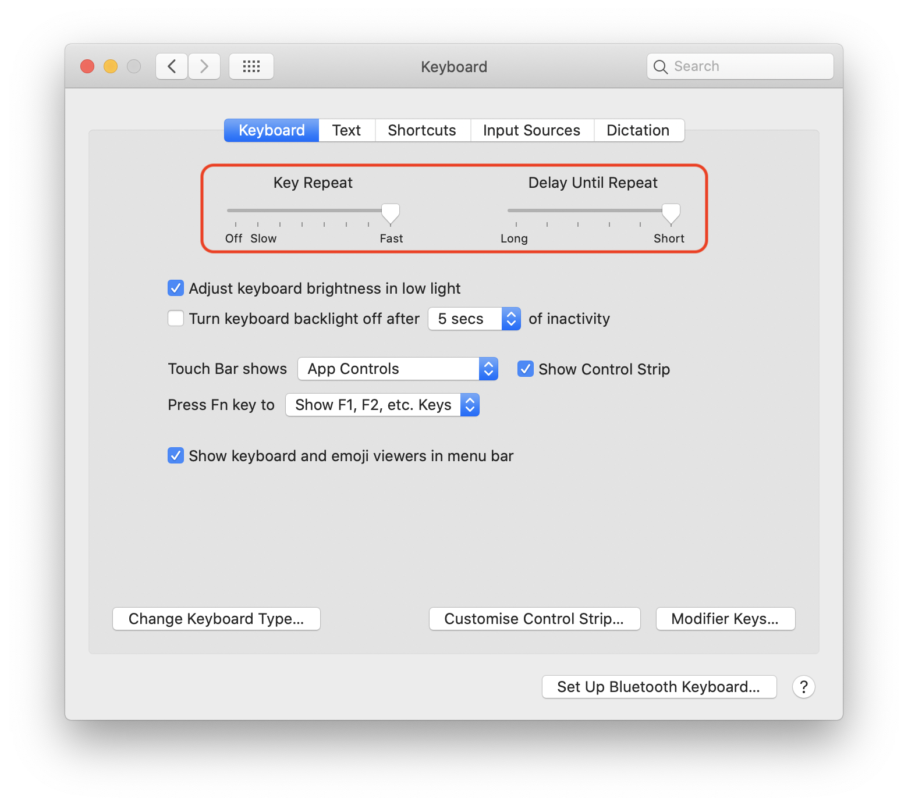
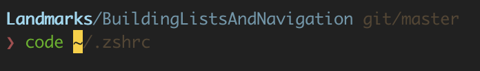

Note: I know all the customisations could be translated to [dotfiles](https://www.quora.com/What-are-dotfiles), something I should do at some point I guess 😅

## Apps

The first ones I download are at the top (Flycut ❤️, caffeine, 1password BetterSnapTool and Dropbox).

1. Flycut - https://apps.apple.com/app/id442160987
2. Caffeine - http://lightheadsw.com/caffeine/
3. 1Password - https://apps.apple.com/app/id1333542190
4. BetterSnapTool - https://apps.apple.com/app/id417375580
5. Dropbox - https://www.dropbox.com/install
6. RescueTime - https://www.rescuetime.com/download-rescuetime
7. Itsycal - https://www.mowglii.com/itsycal/
8. Tripmode - https://www.tripmode.ch
9. Firefox - https://www.mozilla.org/en-US/firefox/new/
10. VLC - https://www.videolan.org/vlc/download-macosx.html
11. Spotify - https://www.spotify.com/download/mac
12. Pocket - https://apps.apple.com/app/id568494494
13. Slack -  https://apps.apple.com/app/id618783545
14. Zeplin - https://zeplin.io
15. Sketch - https://www.sketch.com
16. Sip - https://sipapp.io
17. Monodraw - https://monodraw.helftone.com
18. iTerm2 - https://iterm2.com
19. Trailer.app - https://ptsochantaris.github.io/trailer/
20. Xcode - https://apps.apple.com/app/id497799835
21. Sourcetree - https://www.sourcetreeapp.com
22. Visual Studio Code - https://code.visualstudio.com
23. Kaleidoscope - https://www.kaleidoscopeapp.com
24. Dash - https://kapeli.com/dash
25. Paw - https://paw.cloud
26. Charles Proxy - https://www.charlesproxy.com
27. SnippetsLab - https://apps.apple.com/app/id1006087419
29. DaisyDisk - https://daisydiskapp.com
30. The Unarchiver - https://macpaw.com/the-unarchiver
31. Tunnelblick - https://tunnelblick.net
32. AirBuddy - https://gumroad.com/l/airbuddy
33. Lightpaper - https://getlightpaper.com | Typora - https://www.typora.io
34. Deckset - https://www.deckset.com
35. Pages, Number & Keynote
36. Tweetbot - https://www.tapbots.com/tweetbot/mac/ | Twitter - https://apps.apple.com/app/id1482454543

## Configurations

I'm currently using a MacBook Pro 16" (2019), an external 27" monitor (LG 27UD88-W), trackpad and mechanical keyboard.

### Statusbar

This is how my status bar looks like:

(Clock must be 24h. Show date, no day of week. Show BlueTooth icon. Show Audio icon. Show battery percentage)

### Dock

HIDE the dock, and enter a new world of endless space on your screen. Go to Dock preferences:

### Spaces

I use separated spaces on the left screen (laptop), and the right screen (external monitor). This is how the screen arrangement looks like:

I only use 1 space on the right monitor, while I have 4 spaces on the left screen, plus the terminal on another space for its own.

This is how I use them:

- Space 1: For VS Code or documentation.
- Space 2: Sourcetree
- Space 3: Slack (and other messaging apps like Telegram or Messages occasionally)
- Space 4: Spotify and miscellanea 

It looks something like this: 

I use shortcuts to navigate through them. On the keyboard preferences:

So noooope, I don't want my spaces to rearrange, thanks. On the mission control preferences:

### Hot corners

Not everyone likes them but I have these hot corners defined, for me they're pretty useful, specially when I want to grab something from the desktop real quick. On Mission Control preferences, go to `Hot Corners...`:

### Trackpad

I started using trackpads around 6 years ago, I really prefer it over the mouse for work and normal day to day, specially for text selection and its gestures. For gaming mouse is still king.

First thing is: let's make this faster! Go to Trackpad preferences and change it what feels good for you:

Now we need the best feature ever for trackpads: drag with 3 fingers. Which you can find in `Accessibility > Pointer Control > Trackpad Options...`

### Keyboard

Again, too slow, let's make this fast! Go to keyboard preferences and change it, I go for as fast as it can on "Key Repeat" and as short as possible on "Delay Until Repeat". This will make your cursor move like a lighting when using the keyboard arrows for example.

Note: I was using Karabiner for this before, but Apple added this config on some previous macOS version which is good enough for me, so I don't install Karabiner anymore.

Now, let's remap a few keys. The most common one is `Caps lock`  to `Escape`. I use a mechanical keyboard which detects `Option` and `Command` the other way around so I have to switch them. From the keyboard preferences, go to `Modifier Keys...` and make as you wish:

Although I use a "English USA" keyboard layout, I change quite often between English and Spanish layouts. I have a defined shortcut to switch between them. On the keyboard preferences:

### Safari extensions

- WOT - https://www.mywot.com - Pretty useful when you're not sure about entrusting a website
- 1Password - My password manager of choice
- AdBlock - You just cannot surf without one

### Bonus

#### Blocking hostnames

Blocking hostnames (aka rerouting on `/etc/hosts`) is a must nowadays. It avoids from advertising to malware, gambling or fakenews. Here's the most famoust list I know: https://github.com/StevenBlack/hosts

Note: Depending on what you do, like if you work on advertising (sorry about that) this may affect your workflow, like not properly showing ads on the browser or the iOS simulator. On the other hand, if your app/website has ads, it's a great way to test how it behaves on an environment where ads cannot reach the outside.

## Apps

TODO: explain a bit each app, and potential configs

### 1. Flycut

My clipboard manager of choice, I love how you can go through the last 40 entries you copied hitting shift+cmd+V. It's the first tool I install, for me, inmensely useful.

I edit it to "Display in menu" 40 entries, and switch the icon to "White scissors".

### 2. Caffeine

No need to say much, just keeps my mac from going to sleep when turned on.

### 3. 1Password

My password manager of choice. With Safari and Firefox extensions.

### 4. BetterSnapTool

A great tool to manage all the windows. One thing I really like of this tool is how it maximizes the window if you drag them to the top-center of the screen, like in Windows. It was a feature I really missed from Microsoft.

I have customized the overlay view, I don't like the default one, and deactivated animations:

I have a few shortcuts set up, like maximize window (ctrl+option+cmd+f), center (ctrl+option+cmd+c) or move to next monitor (shift+ctrl+option+cmd+arrow):

### 18. Terminal (iTerm2 + zsh)

I use my own color scheme, which you can find here: [`preferences/iTerm_colors.itermcolors`](/preferences/iTerm_colors.itermcolors)

You can set it up on iTerm2 going to the app preferences. Then go to Profiles, add a new one. Go to the Colors tab, then `Color Presets...`,  `Import...` and select the `.itermcolors` file. Don't forget to set this profile as default before restarting iTerm from `Other Actions...`

I use [zsh](https://www.zsh.org) as m shell, and I use [oh-my-zsh](https://ohmyz.sh) to configure it.

I like the theme [refined](https://github.com/ohmyzsh/ohmyzsh/blob/master/themes/refined.zsh-theme), it's clean when it has to, or it shows info when it can, like the path or git branch.

Plugins I use:

- [git](https://github.com/ohmyzsh/ohmyzsh/tree/master/plugins/git): Adds useful git shortcuts. 
- [wd](https://github.com/ohmyzsh/ohmyzsh/tree/master/plugins/wd): Let's you add shortcuts to specific folders, like `DerivedData`, `Library` or your projects/dev folder.
- [zsh-autosuggestions](https://github.com/zsh-users/zsh-autosuggestions): Autocompletes you commands on the go, really nice. Something I loved in Fish and wanted with zsh. You have to take further steps to install it since it doesn't come with `oh-my-zsh`.
- [zsh-syntax-highlighting](https://github.com/zsh-users/zsh-syntax-highlighting): Highlights your commands on the go. You have to take further steps to install it since it doesn't come with `oh-my-zsh`.

All the configuration go are set on the [`.zshrc` file](/preferences/oh-my-zsh/zshrc.txt). I also have a handy [`env.sh` file](/preferences/oh-my-zsh/env.sh) with a few aliases and stuff. I specially like the `openx()` func which I totally [copied](https://orta.io/rebase/on/opening-xcode-projects-and-workspaces) from @orta.

### 19. Trailer.app

Handy app to get notified and quickly jump into your Github issues and PRs.

I have the configuration file at [preferences/TrailerSettings_2019_01.trailerSettings](preferences/TrailerSettings_2019_01.trailerSettings). It's missing an entry for the Github credentials which I deleted, so don't use that file replacing yours directly.

### 20. Xcode

Xcode, you probably know what it is, if not, it's the main IDE to develop on the Apple ecosystem. I don't want to talk much about it since there're great resources like plugins and shortcuts all around. 

I use my own color scheme, which you can find here: https://github.com/Lascorbe/omgthemes

My font of choice is Source Code Pro: https://github.com/adobe-fonts/source-code-pro